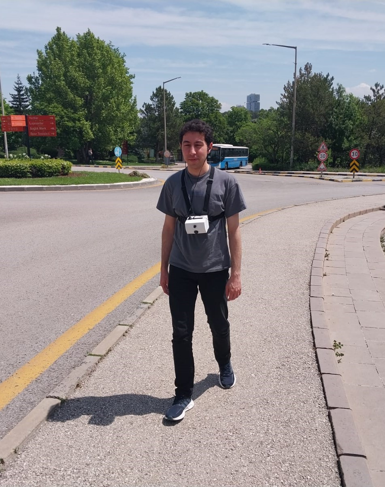

# Aid-for-the-Blind
It was my senior year project. It was done by a group of five students. 
I was responsible for creating a detection model with a Raspberry Pi Camera and writing its code in Python. 

best.py file is the weights of the trained YOLO model. 

Our project and me: 

